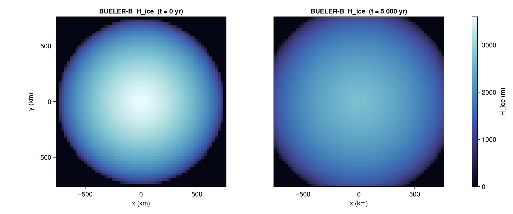
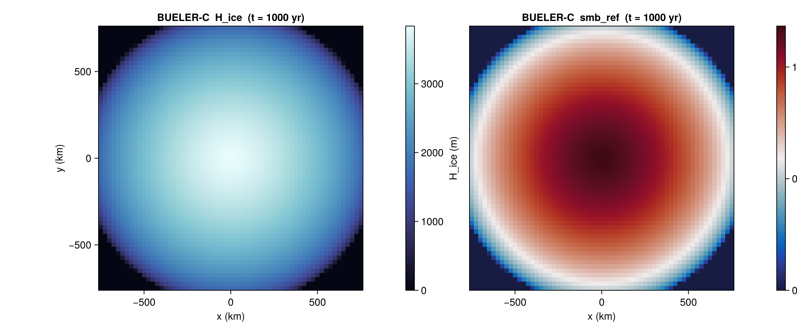

# Bueler — Halfar dome

[`BuelerBenchmark`](@ref) ports the Bueler et al. (2005) isothermal-SIA
analytical tests built on the Halfar (1981) similarity solution. The
benchmark gives a closed-form ice thickness, surface mass balance, and
depth-averaged velocity field at any time `t ≥ 0`, making it the most
rigorous self-consistency check available for an SIA implementation.

Two variants are implemented:

- **`:B`** — pure decay, no mass-balance forcing (`λ = 0`).
- **`:C`** — decay with the analytical mass-balance source
  `mbal = λ H / t` (`λ > 0`, prescribed).

## Constructor

```julia
BuelerBenchmark(variant::Symbol;
                dx_km::Real,
                R0_km::Real = 750.0,
                H0::Real    = 3600.0,
                lambda      = nothing,
                n::Real     = 3.0,
                A::Real     = 1.0e-16,
                rho_ice::Real = 910.0,
                g::Real       = 9.81)
```

The grid is square, centred on the origin, with extent
`±R0_km × ±R0_km` in metres and `Nx = Ny = 2·R0_km/dx_km + 1`. The
constructor requires `2·R0_km/dx_km` to be an integer.

`variant = :C` requires the `lambda` keyword; `variant = :B`
rejects it.

## Sub-tests

### `:B` — pure Halfar decay

A radially symmetric dome of initial height `H0` and radius `R0`
spreads under SIA gravity-driven flow with no surface mass balance.
The analytical thickness follows Bueler 2005 Eqs. 10–11. Closed-form
depth-averaged velocity is available via [`analytical_velocity`](@ref).

```julia
b = BuelerBenchmark(:B; dx_km = 25.0)
s = state(b, 0.0)         # initial dome
s_late = state(b, 5_000.0)  # after 5 kyr of decay
ux, uy = analytical_velocity(b, 100.0)  # m/yr, face-staggered
```



### `:C` — Halfar with analytical mass balance

Identical geometry, but with a non-zero mass-balance scale `λ` driving
a closed-form source `mbal = λ H / t`. Tests the SIA solver's response
to a non-trivial surface forcing whose analytical solution is known.

```julia
b = BuelerBenchmark(:C; dx_km = 25.0, lambda = 5.0)
s = state(b, 1_000.0)
# s.H_ice and s.smb_ref both analytical
```



## Helpers

```@docs
BuelerBenchmark
bueler_gamma
bueler_test_BC!
```

## References

- Bueler, E., Lingle, C. S., Kallen-Brown, J. A., Covey, D. N. and
  Bowman, L. N. (2005). *Exact solutions and verification of numerical
  models for isothermal ice sheets.* J. Glaciol., 51(173), 291–306.
- Halfar, P. (1981). *On the dynamics of the ice sheets.*
  J. Geophys. Res., 86(C11), 11065–11072.
