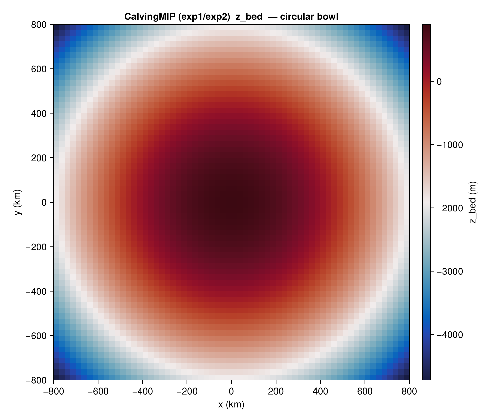
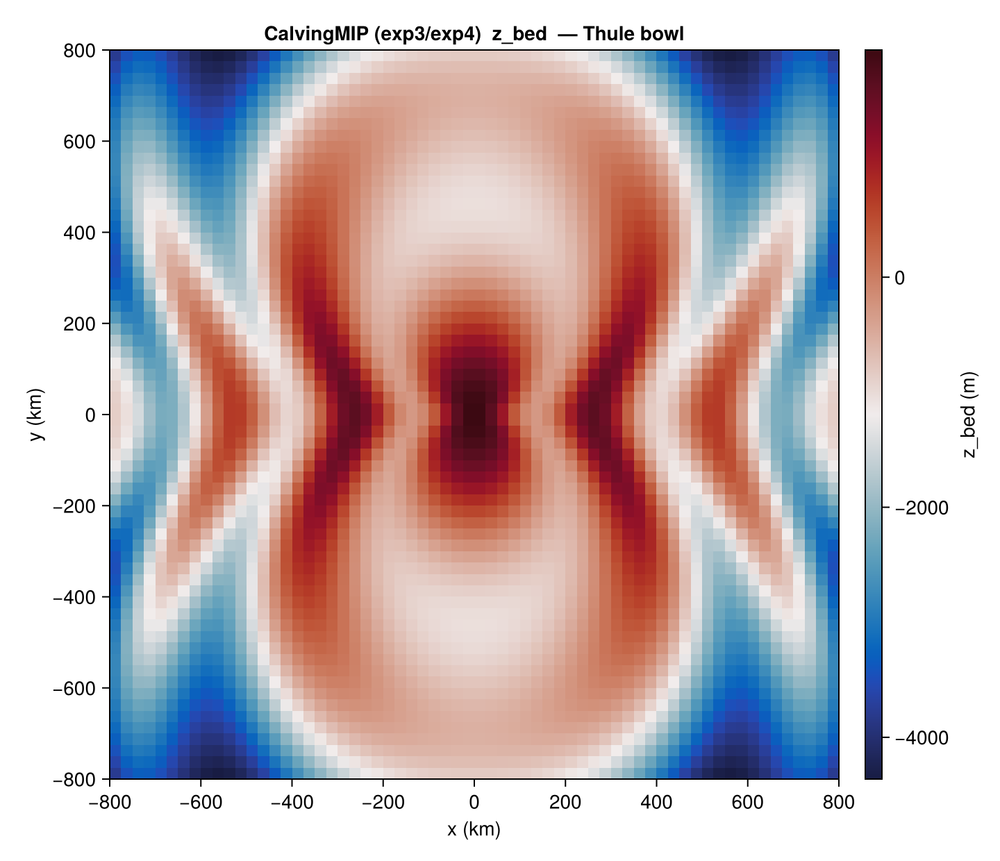

# CalvingMIP

[`CalvingMIPBenchmark`](@ref) covers the four CalvingMIP intercomparison
experiments (Cornford et al., CalvingMIP). An idealised ice sheet
grows from zero on either a circular parabolic bowl or the "Thule"
bowl (parabolic plus azimuthal cosine modulation) under a constant
positive surface mass balance. The four experiments differ in bed
geometry and in the calving-front condition.

The package provides:

- the bed geometry and IC fields via `state(b, 0)`,
- the closed-form bed helpers
  [`calvmip_bed_circular`](@ref) / [`calvmip_bed_thule`](@ref), and
- the calving-rate laws as model-agnostic in-place kernels
  [`calvmip_exp1!`](@ref) / [`calvmip_exp2!`](@ref) on plain arrays.

## Constructor

```julia
CalvingMIPBenchmark(exp::Symbol;
                    dx_km::Real        = 25.0,
                    smb_const::Real    = 0.3,
                    T_srf_const::Real  = 223.15,
                    Q_geo_const::Real  = 42.0)
```

The domain is `[−800, +800] km × [−800, +800] km` at cell centres
(64×64 cells at the default 25 km). Four experiments are supported:
`:exp1`, `:exp2`, `:exp3`, `:exp4`.

## Sub-tests

### `:exp1` — circular bowl, velocity-equilibrium pinned front

Bed from [`calvmip_bed_circular`](@ref) — a parabolic bowl centred at
the origin. The calving rate is set so that the front comes to
equilibrium near `r = 750 km`. Use [`calvmip_exp1!`](@ref) to compute
`cr_x` / `cr_y` from the depth-averaged velocity, ice thickness, ice
fraction, and level-set function:

```julia
b = CalvingMIPBenchmark(:exp1; dx_km = 25.0)
s = state(b, 0.0)
# Host integrates forward; at every step:
calvmip_exp1!(cr_x, cr_y, u_bar, v_bar, H_ice, f_ice, lsf, t;
              xc = b.xc, yc = b.yc, r_lim = 750e3)
```



### `:exp2` — circular bowl, oscillating front

Same bed as `:exp1`. The calving-front velocity is forced to oscillate
with amplitude ±300 m/yr and period 1000 yr via
[`calvmip_exp2!`](@ref):

```julia
b = CalvingMIPBenchmark(:exp2; dx_km = 25.0)
calvmip_exp2!(cr_x, cr_y, u_bar, v_bar, H_ice, f_ice, lsf, t;
              xc = b.xc, yc = b.yc)
```

The bed figure is identical to the `:exp1` figure above.

### `:exp3` — Thule bowl, velocity-equilibrium pinned front

Bed from [`calvmip_bed_thule`](@ref) — the parabolic bowl modulated by
an azimuthal cosine that produces five embayments around the rim. The
calving law is `calvmip_exp1!`.



### `:exp4` — Thule bowl, oscillating front

Same bed as `:exp3`. The calving law is `calvmip_exp2!` (oscillating
front).

## Helpers

```@docs
CalvingMIPBenchmark
calvmip_bed_circular
calvmip_bed_thule
```

## References

- Cornford, S. L. et al. (CalvingMIP). *Intercomparison of calving-front
  parameterisations.*
