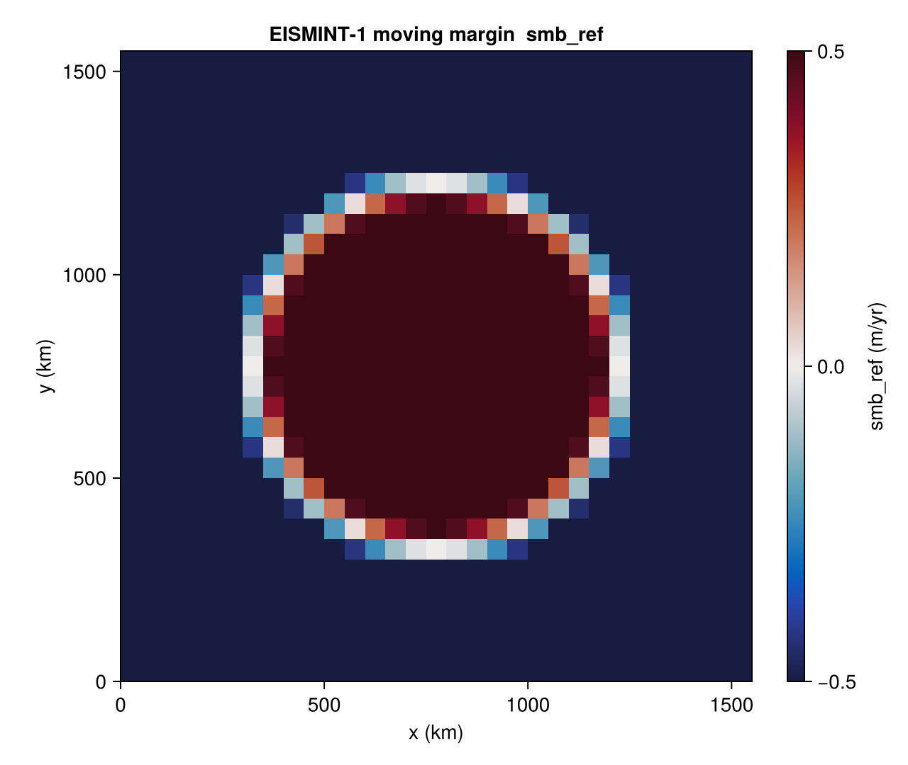

# EISMINT-1 moving margin

[`EISMINT1MovingBenchmark`](@ref) is the moving-margin experiment of
the original EISMINT intercomparison (Huybrechts et al. 1996). The ice
sheet grows from zero on a flat bed under a radial surface mass-balance
pattern with a finite equilibrium-line radius; the margin advances
freely (it is not pinned by domain edges or sea level).

There is no closed-form solution. The benchmark is host-driven and
typically compared against the published steady-state dome heights and
margin positions across the EISMINT intercomparison models.

## Constructor

```julia
EISMINT1MovingBenchmark(;
    dx_km::Real        = 50.0,
    L_km::Real         = 1500.0,
    R_el_km::Real      = 450.0,
    smb_max::Real      = 0.5,
    smb_grad::Real     = 0.01,
    T_srf_const::Real  = 270.0,
    Q_geo_const::Real  = 42.0,
    n_glen::Real       = 3.0,
    A_glen::Real       = 1.0e-16)
```

The grid is square `[−L/2, +L/2]² ` with cell centres so that the
summit (origin) sits at a grid node.

## Forcing

The surface mass balance is a radial cap pattern around the origin:

```
smb_ref(x, y) = min(smb_max, smb_grad · (R_el − r))      r = √(x² + y²)
```

i.e. a positive cap of `smb_max` (m/yr) for `r ≤ R_el − smb_max/smb_grad`,
linearly decreasing to zero at `r = R_el`, and increasingly negative
beyond. With the defaults, `R_el = 450 km` and the saturation radius
is at `r = 400 km`.

`state(b, 0)` returns zero ice (`H_ice = 0`), a flat bed, a very
negative sea level (forces all grounded), the radial SMB pattern,
uniform `T_srf = 270 K` and `Q_geo = 42 mW m⁻²`, and a fully dynamic
ice mask. Hosts integrate forward to reach the moving-margin steady
state.



## Helpers

```@docs
EISMINT1MovingBenchmark
eismint_moving_smb
```

## References

- Huybrechts, P. et al. (1996). *The EISMINT benchmarks for testing
  ice-sheet models.* Ann. Glaciol., 23, 1–12.
