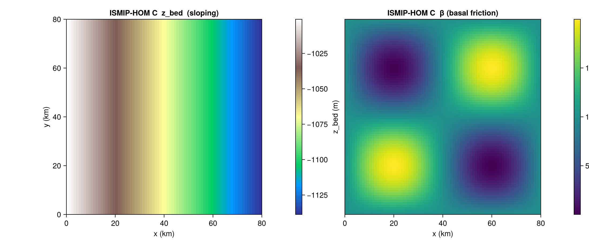

# ISMIP-HOM Experiment C

[`HOMCBenchmark`](@ref) implements Experiment C from the ISMIP-HOM
intercomparison (Pattyn et al. 2008): a uniform slab of ice over a
gently sloping bed with a sinusoidally varying basal friction
coefficient. Under fully periodic boundary conditions, the steady-state
velocity field exhibits a 180° rotational anti-symmetry that any
higher-order or full-Stokes solver should reproduce.

There is no closed-form velocity solution; verification is via
inter-model comparison on the published tables.

## Constructor

```julia
HOMCBenchmark(variant::Symbol = :C;
              L_km::Real      = 80.0,
              dx_km::Real     = 0.25 * (L_km / 10.0),
              alpha_deg::Real = 0.1,
              H::Real         = 1000.0,
              A_glen::Real    = 1.0e-16,
              n_glen::Real    = 3.0,
              beta0::Real     = 1000.0,
              beta_amp::Real  = 1000.0,
              rho_ice::Real   = 910.0,
              g::Real         = 9.81)
```

The grid is square `[0, L] × [0, L]` with cell centres at
`((i − 0.5) dx, (j − 0.5) dx)`. The constructor requires `L_km/dx_km`
to be an integer.

## Sub-tests

### `:C` — sloping bed, sinusoidal basal friction

The only variant currently supported. The bed is `z_bed(x) = −x · tan α − H`
and the basal friction coefficient is

```
β(x, y) = β₀ + β_amp · sin(2π x / L) · sin(2π y / L)        [Pa yr m⁻¹]
```

[`state`](@ref) returns an isothermal uniform slab (`H_ice = 1000 m`),
the sloping bed, a very negative sea level to force grounded ice,
zero SMB, and arbitrary `T_srf = 263.15 K` / `Q_geo = 50 mW m⁻²`. The
basal-friction field `β` is **not** returned in `state` — it is a
host-side field; use the helper `IceSheetBenchmarks._hom_c_beta(b, x, y)`
to fill it.

```julia
b = HOMCBenchmark(:C; L_km = 80.0, dx_km = 1.0)
s = state(b, 0.0)
# s.H_ice, s.z_bed, s.z_sl, s.smb_ref, s.T_srf, s.Q_geo
```



## Helpers

```@docs
HOMCBenchmark
```

## References

- Pattyn, F. et al. (2008). *Benchmark experiments for higher-order
  and full-Stokes ice sheet models (ISMIP-HOM).* The Cryosphere, 2,
  95–108.
