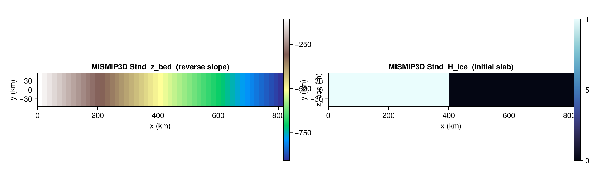

# MISMIP3D

[`MISMIP3DBenchmark`](@ref) sets up the Marine Ice Sheet Model
Intercomparison Project Phase 3D (Pattyn et al. 2013): a thin slab of
ice on a reverse-sloping bed, used to study grounding-line migration
and marine ice sheet (in)stability under three-dimensional flow.

There is no closed-form solution. The benchmark is host-driven and
typically run for many thousand years to reach a steady grounding-line
position before applying perturbations.

## Constructor

```julia
MISMIP3DBenchmark(variant::Symbol = :Stnd;
                  dx_km::Real        = 16.0,
                  xmax_km::Real      = 800.0,
                  Ly_km::Real        = 100.0,
                  H0::Real           = 10.0,
                  z_bed_floor::Real  = -500.0,
                  bed_intercept::Real = -100.0,
                  bed_slope::Real    = 1.0,
                  smb_const::Real    = 0.5,
                  T_srf_const::Real  = 273.15,
                  Q_geo_const::Real  = 42.0,
                  n_glen::Real       = 3.0,
                  A_glen::Real       = 3.1536e-18,
                  cf_ref::Real       = 3.165176e4,
                  N_eff_const::Real  = 1.0)
```

The domain is `[0, xmax_km] × [−Ly_km/2, +Ly_km/2]`. The y-axis is
implicitly periodic in the host's setup; an odd number of cells in y
is chosen so the centerline coincides with a grid row.

## Sub-tests

### `:Stnd` — standard buildup

A 10 m slab of ice covers the portion of the domain where
`z_bed ≥ z_bed_floor`; everywhere else `H_ice = 0`. The bed is a
linear reverse slope `z_bed(x) = bed_intercept − bed_slope · (x [km])`,
ranging from `−100 m` at `x = 0` to deep below the floor near `x = 800 km`.
Sea level is 0, so the slab is largely floating; perturbations migrate
the grounding line. The eastern column carries `mask_ice = 0` to
provide a calving outflow boundary.

```julia
b = MISMIP3DBenchmark(:Stnd; dx_km = 16.0)
s = state(b, 0.0)
# s.H_ice (10 m slab), s.z_bed (reverse slope), s.smb_ref = 0.5 m/yr
```



## Helpers

```@docs
MISMIP3DBenchmark
```

## References

- Pattyn, F. et al. (2013). *Grounding-line migration in plan-view
  marine ice-sheet models: results of the ice2sea MISMIP3d
  intercomparison.* J. Glaciol., 59(215), 410–422.
