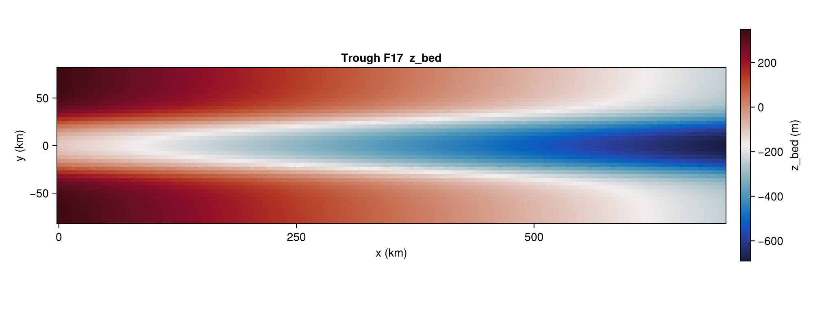

# Trough — Feldmann & Levermann 2017

[`TroughBenchmark`](@ref) implements the trough geometry from Feldmann
& Levermann (2017): an idealised marine ice-stream domain with a
central reverse-slope channel bordered by raised side walls. The
geometry triggers grounding-line migration and streaming instabilities
without the complications of a realistic margin.

There is no closed-form solution; the benchmark is host-driven and
typically evaluated by running the model to steady state (or to
cyclic surging) and comparing against the published reference.

## Constructor

```julia
TroughBenchmark(variant::Symbol;
                dx_km::Real      = 4.0,
                lx_km::Real      = 700.0,
                ly_km::Real      = 160.0,
                fc_km::Real      = 16.0,
                dc_m::Real       = 500.0,
                wc_km::Real      = 24.0,
                x_cf_km::Real    = 640.0,
                Tsrf_const::Real = -20.0,
                smb_const::Real  = 0.3,
                Qgeo_const::Real = 70.0,
                rho_ice::Real    = 910.0,
                g::Real          = 9.81)
```

The grid spans `[0, lx] × [−ly/2, +ly/2]` (km) at cell centres.

## Sub-tests

### `:F17` — Feldmann & Levermann (2017) bed

The only variant currently implemented. The bed elevation is a closed
form

```
z_bed(x, y) = max(zb_x(x) + zb_y(y), zb_deep)
zb_x(x)     = −150 − 0.84 · |x|                                [m]
zb_y(y)     = dc / (1 + exp(−2(y − wc) / fc))
            + dc / (1 + exp( 2(y + wc) / fc))                  [m]
```

with `zb_deep = −720 m`. The cross-section is a parabolic reverse slope
in `x` with a central trough bordered by raised embayments in `y`.

`state(b, 0)` returns the closed-form trough bed, zero ice, sea level
at 0, and the uniform climate fields (`smb_const`, `Tsrf_const`
converted to K, `Qgeo_const`). There is no closed-form transient
solution, so `state(b, t > 0)` errors; hosts obtain non-zero times by
running the model forward.

```julia
b = TroughBenchmark(:F17; dx_km = 4.0)
s = state(b, 0.0)
# s.z_bed (F17 trough), s.H_ice = 0, s.smb_ref = 0.3 m/yr, s.T_srf, s.Q_geo

# The bed helper is also exposed directly (km units):
z_bed = [IceSheetBenchmarks._trough_f17_zbed(b.xc[i]/1e3, b.yc[j]/1e3,
                                              b.fc_km, b.dc_m, b.wc_km)
         for i in eachindex(b.xc), j in eachindex(b.yc)]
```



## Helpers

```@docs
TroughBenchmark
```

## References

- Feldmann, J. & Levermann, A. (2017). *From cyclic ice streaming to
  Heinrich-like events: the grow-and-surge instability in the Parallel
  Ice Sheet Model.* The Cryosphere, 11, 1913–1932.
